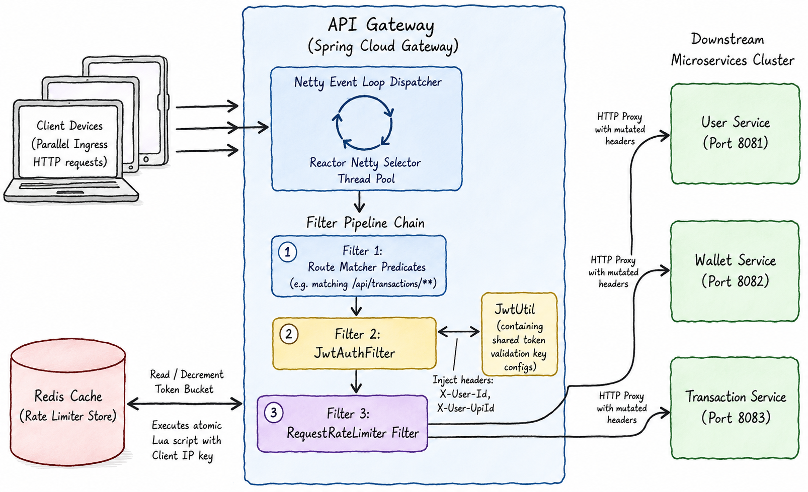

# 🟠 API Gateway: Intensive System Design & Interview Guide

The **API Gateway** (Port 8080) is the entry point for all client requests. Built on **Spring Cloud Gateway**, **Spring WebFlux**, and **Netty**, it handles edge routing, extracts JWT claims, and enforces rate limits using a Redis Token Bucket.

---

## 🗺️ 1. Core Architecture, Thread Model, & Filter Pipeline

The API Gateway uses an asynchronous, non-blocking **event loop** architecture to scale handles under load without thread-per-request limitations.



### 🧵 Reactive Thread Architecture: Tomcat vs Netty

| Dimension | Tomcat (Servlet Container) | Netty (Reactive Server) |
|---|---|---|
| **Thread Pool** | Large (`200+` threads). | Small (usually matches CPU core count). |
| **I/O Strategy** | Blocking (one thread per active request). | Non-blocking (asynchronous events). |
| **Throughput** | Drops when threads block on downstream services. | Remains stable; threads are freed immediately. |
| **Memory** | High (each thread reserves stack memory, ~1MB). | Low (shares memory across connections). |

### 🛡️ Filter Chain Processing
1. **Predicates**: Evaluates route paths (e.g., `/api/transactions/**`).
2. **Filters**: Passes matched requests through global and route-specific filters.
3. **JWT Extraction**: Parses, validates, and forwards token claims.
4. **Rate Limit**: Runs rate checking logic against the Redis instance.

---

## 🔄 2. Step-by-Step Filter Pipeline Flow

### Ingress & Authentication Path
1. **Receive**: Netty event loop accepts the request and maps it to a route configuration.
2. **Route Match**: If the path is public (e.g., `/api/auth/register`), the JWT filter is bypassed. For protected paths (e.g., `/api/transactions/pay`), routes through `JwtAuthFilter`.
3. **JWT Verification**:
   - Extracts the header value: `Authorization: Bearer <token>`.
   - Parses and validates the signature using the configured secret key.
   - Verifies expiration.
4. **Header Injection**: Mutates the request to inject claims as downstream headers:
   - Sets header `X-User-Id` to the token's subject.
   - Sets header `X-User-UpiId` to the claims payload.
5. **Token Bucket Rate Limiting**:
   - The `RequestRateLimiter` filter executes a Lua script against Redis using the client's IP address.
   - The script performs the token check atomically.
6. **Forward**: If a token is available, forwards the mutated request to the target service.

---

## 🛑 3. Detailed Negative Scenarios & Failures

### Scenario A: Invalid or Expired JWT Signature
- **Trigger**: Client sends a request with an expired JWT or a signature modified by a third party.
- **Handling**: The `JwtAuthFilter` attempts to parse the token. The parser throws an `ExpiredJwtException` or `SignatureException`.
- **Result**: The filter blocks the request and returns a `401 Unauthorized` response with the body `INVALID_TOKEN` directly at the edge, protecting downstream services.

### Scenario B: Token Bucket Empty (Rate Limit Hit)
- **Trigger**: A client script sends 50 requests per second.
- **Handling**: The rate limiter check runs. Redis counts available tokens. If the bucket is empty, the check returns `0`.
- **Result**: The filter blocks the request and returns a `429 Too Many Requests` response. The downstream services do not receive the traffic.

### Scenario C: Downstream Gateway Timeout
- **Trigger**: The Transaction Service is overloaded and fails to respond within the gateway's read timeout limit (e.g., 5 seconds).
- **Handling**: WebFlux's HTTP client triggers a gateway timeout.
- **Result**: The gateway returns a `504 Gateway Timeout` response.

### Scenario D: Redis Outage (Fail-Open Recovery)
- **Trigger**: The Redis cluster goes down.
- **Handling**: The `RequestRateLimiter` filter throws a connection exception.
- **Result**: To prevent blocking all traffic, the gateway logs the warning and fails-open, allowing requests through without rate limiting.

---

## 💻 4. Code Snippets: Implementation Details

### JWT Validation Filter (`JwtAuthFilter.java`)
```java
@Component
@Slf4j
public class JwtAuthFilter extends AbstractGatewayFilterFactory<JwtAuthFilter.Config> {

    private final JwtUtil jwtUtil;

    public JwtAuthFilter(JwtUtil jwtUtil) {
        super(Config.class);
        this.jwtUtil = jwtUtil;
    }

    @Override
    public GatewayFilter apply(Config config) {
        return (exchange, chain) -> {
            ServerHttpRequest request = exchange.getRequest();

            // 1. Check for Authorization header
            if (!request.getHeaders().containsKey(HttpHeaders.AUTHORIZATION)) {
                return onError(exchange, "Missing Authorization Header", HttpStatus.UNAUTHORIZED);
            }

            String authHeader = request.getHeaders().getFirst(HttpHeaders.AUTHORIZATION);
            if (authHeader == null || !authHeader.startsWith("Bearer ")) {
                return onError(exchange, "Invalid Authorization Header format", HttpStatus.UNAUTHORIZED);
            }

            String token = authHeader.substring(7);

            try {
                // 2. Validate token and extract claims
                Claims claims = jwtUtil.getAllClaimsFromToken(token);
                if (jwtUtil.isTokenExpired(token)) {
                    return onError(exchange, "Token has expired", HttpStatus.UNAUTHORIZED);
                }

                // 3. Inject claims as headers for downstream services
                ServerHttpRequest mutatedRequest = request.mutate()
                        .header("X-User-Id", claims.getSubject())
                        .header("X-User-UpiId", claims.get("upiId", String.class))
                        .header("X-User-Phone", claims.get("phone", String.class))
                        .build();

                return chain.filter(exchange.mutate().request(mutatedRequest).build());

            } catch (Exception e) {
                log.error("JWT token verification failed: {}", e.getMessage());
                return onError(exchange, "Token verification failed", HttpStatus.UNAUTHORIZED);
            }
        };
    }

    private Mono<Void> onError(ServerWebExchange exchange, String err, HttpStatus status) {
        ServerHttpResponse response = exchange.getResponse();
        response.setStatusCode(status);
        response.getHeaders().setContentType(MediaType.APPLICATION_JSON);
        
        String body = String.format("{\"error\": \"%s\", \"message\": \"%s\"}", status.name(), err);
        DataBuffer buffer = response.bufferFactory().wrap(body.getBytes(StandardCharsets.UTF_8));
        return response.writeWith(Mono.just(buffer));
    }

    public static class Config {}
}
```

### Gateway Routing and Rate Limiter Configurations (`application.yml`)
```yaml
spring:
  cloud:
    gateway:
      routes:
        - id: transaction-service
          uri: lb://transaction-service
          predicates:
            - Path=/api/transactions/**
          filters:
            - JwtAuthFilter
            - name: RequestRateLimiter
              args:
                redis-rate-limiter.replenishRate: 10 # refills 10 tokens per second
                redis-rate-limiter.burstCapacity: 20 # maximum bucket capacity
                key-resolver: "#{@userKeyResolver}"
```

---

## 🎨 5. Excalidraw Prompt: Entire API Gateway Architecture & Flow
> **Excalidraw Prompt:** 
> Create a comprehensive, professional system architecture and request pipeline diagram of the API Gateway in a clean, hand-drawn Excalidraw style.
> 
> **Layout & Boxes:**
> 1. **Left Side: Client Requests Ingress**
>    - Draw multiple overlapping client device boxes labeled "Client Devices (Parallel Ingress HTTP requests)".
>    - Draw block arrows pointing from these devices to the API Gateway.
> 
> 2. **Center: API Gateway Container**
>    - Draw a large vertical rectangular container labeled "API Gateway (Spring Cloud Gateway)".
>    - Inside it, draw the internal execution components:
>      - **Netty Event Loop Dispatcher** (Fill color: Pastel Blue). Show a circular loop thread icon, representing "Reactor Netty Selector Thread Pool".
>      - **Filter Pipeline Chain**: Draw a vertical sequence of 3 linked filter blocks:
>        - Filter 1: "Route Matcher Predicates" (e.g. matching `/api/transactions/**`).
>        - Filter 2: "JwtAuthFilter" (Fill color: Pastel Yellow). Show a linked side-box: "JwtUtil" (containing shared token validation key configs).
>        - Filter 3: "RequestRateLimiter Filter" (Fill color: Pastel Purple).
> 
> 3. **Left-Center Side: Redis Rate Limiter Store**
>    - Draw a cylinder labeled "Redis Cache (Rate Limiter Store)" connected directly to the "RequestRateLimiter Filter" (Filter 3). Show a sub-label inside the connection line: "Executes atomic Lua script with Client IP key".
> 
> 4. **Right Side: Downstream Microservices Cluster**
>    - Draw a vertical column of three microservice boxes (Fill color: Pastel Green):
>      - Box 1: "User Service (Port 8081)"
>      - Box 2: "Wallet Service (Port 8082)"
>      - Box 3: "Transaction Service (Port 8083)"
> 
> **Connections & Arrows:**
> - Draw a solid arrow from the Client Devices to the Netty Event Loop.
> - Draw a downward arrow from the Event Loop passing requests through the Filter Pipeline sequence (Route Matcher -> JwtAuthFilter -> RequestRateLimiter Filter).
> - Draw a double-headed arrow between "JwtAuthFilter" and "JwtUtil" representing claim checks. Show an overlay text label: "Inject headers: X-User-Id, X-User-UpiId".
> - Draw a double-headed arrow between "RequestRateLimiter Filter" and the "Redis Cache" cylinder. Label it: "Read / Decrement Token Bucket".
> - Draw routing output lines pointing from the RequestRateLimiter Filter to the target downstream microservices on the right. Label these lines: "HTTP Proxy with mutated headers".
> 
> **Styling & Aesthetics:**
> - Use handwritten-style fonts (like Excalidraw's default).
> - Apply subtle borders with a hand-drawn wave effect.
> - Color-code the layers with distinct pastel fills.

