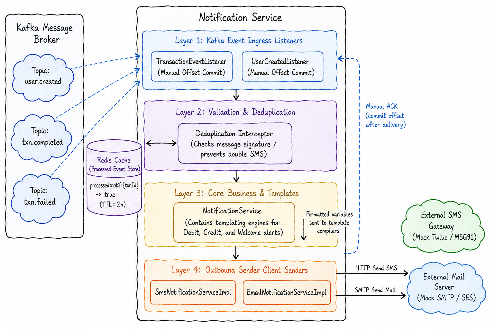

# 🔔 Notification Service: Intensive System Design & Interview Guide

The **Notification Service** (Port 8084) is a consumer service that handles asynchronous alert delivery (such as credit and debit SMS notifications). It operates using **Eventual Consistency** and uses **Redis** to prevent duplicate alerts.

---

## 🗺️ 1. Core Architecture, Consumer Mechanics, & Event Contracts

The Notification Service operates outside the critical path of payments. It listens to Kafka topics using a decoupled, event-driven consumer architecture.



### ⚙️ Kafka Consumer Configurations
- **Group ID**: `upi-notification-group` ensures that instances of the service share the message processing load.
- **Deserializer**: Maps JSON payloads to event classes using `ErrorHandlingDeserializer` to prevent serialization errors from blocking partitions.
- **Offset Management**: Configured with `enable.auto.commit = false`. Offsets are committed manually only after the notification is successfully processed.

### 📝 Event Contracts

#### Topic: `user.created`
- **Partition Key**: `userId`
- **Fields**: `{ "userId": "UUID", "upiId": "String", "fullName": "String", "phone": "String" }`

#### Topics: `txn.completed` / `txn.failed`
- **Partition Key**: `senderUpiId` or `receiverUpiId`
- **Fields**: `{ "transactionId": "UUID", "senderUpiId": "String", "receiverUpiId": "String", "amount": "Numeric", "status": "String", "failureReason": "String" }`

---

## 🔄 2. Step-by-Step Notification Processing Flow

### Asynchronous Alert Pipeline
1. **Poll**: The Kafka consumer poll loop retrieves messages from subscribed topics.
2. **Deduplication Check**:
   - Extracts the `transactionId` or event ID.
   - Runs `redisTemplate.opsForValue().setIfAbsent("processed:notif:" + id, "true", Duration.ofHours(1))`.
   - If Redis returns `false`, the message is skipped as a duplicate.
3. **Template Resolution**: Resolves the message content:
   - **Credit Alert**: `"₹{amount} credited to your wallet. Ref: {txnId}."`
   - **Debit Alert**: `"₹{amount} debited from your wallet. Ref: {txnId}."`
4. **Outbound Dispatch**: Calls the mock SMS/email gateway.
5. **Offset Commit**: Acknowledges the message in Kafka.

---

## 🛑 3. Detailed Negative Scenarios & Failures

### Scenario A: Consumer Partition Rebalances (Duplicate Events)
- **Trigger**: A new container instance of the Notification Service starts, triggering a partition rebalance. A consumer node is stopped before it can commit the offset for a processed message.
- **Failure Sequence**:
  1. The new consumer instance receives the uncommitted message again.
  2. The service attempts to process the message.
- **Deduplication Resolution**: The deduplication check runs. Redis finds the key `processed:notif:{id}` and returns `false`. The message is skipped, preventing duplicate notifications.

### Scenario B: SMS Provider Outage (Retry Policies)
- **Trigger**: The SMS gateway provider is down, causing calls to time out or return errors.
- **Handling**: The dispatch method throws an exception.
- **Result**:
  - The catch block runs.
  - The transaction offset is **not** committed to Kafka.
  - The listener throws the exception back to the container, which retries the message with an exponential backoff.
  - If the retries exceed the limit (e.g., 3 attempts), the message is routed to a Dead Letter Queue (DLQ) to prevent blocking the partition.

### Scenario C: Poison Pill Message (JSON Deserialization Exception)
- **Trigger**: A bug in an upstream service publishes a malformed JSON message to the topic.
- **Handling**: The standard deserializer throws an exception, failing to parse the payload.
- **Result**: Using `ErrorHandlingDeserializer` prevents partition blockage. The deserialization exception is caught, the invalid message is logged, and the payload is routed to a DLQ (`txn.completed.DLQ`) for analysis. The consumer then moves to the next message.

### Scenario D: Redis Store Offline (Deduplication Fail-Open)
- **Trigger**: The Redis cache is unreachable during the deduplication check.
- **Handling**: The Redis check throws a connection exception.
- **Result**: The service log a warning and falls back to a fail-open strategy. It processes the event and sends the notification to ensure alert delivery, accepting the risk of duplicate notifications during the outage.

---

## 💻 4. Code Snippets: Implementation Details

### Kafka Event Listener (`TransactionEventListener.java`)
```java
@Component
@RequiredArgsConstructor
@Slf4j
public class TransactionEventListener {

    private final SmsNotificationService smsService;
    private final StringRedisTemplate redisTemplate;

    @KafkaListener(
        topics = {KafkaTopics.TXN_COMPLETED, KafkaTopics.TXN_FAILED},
        groupId = "upi-notification-group",
        containerFactory = "kafkaListenerContainerFactory"
    )
    public void onTransactionEvent(TransactionEventPayload event, Acknowledgment ack) {
        String txnId = event.getTransactionId().toString();
        log.info("Received transaction event for txnId={}, status={}", txnId, event.getStatus());

        try {
            // 1. Check for duplicates in Redis
            Boolean isNew = redisTemplate.opsForValue().setIfAbsent(
                    "processed:notif:" + txnId,
                    "true",
                    Duration.ofHours(2)
            );

            if (Boolean.FALSE.equals(isNew)) {
                log.warn("Duplicate event detected. Skipping alert dispatch for txnId={}", txnId);
                ack.acknowledge(); // Commit offset to prevent reprocessing
                return;
            }

            // 2. Format and send notifications
            if ("SUCCESS".equals(event.getStatus())) {
                // Send debit notification to sender
                smsService.sendSms(
                        event.getSenderPhone(),
                        String.format("₹%.2f debited from your wallet. Ref: %s.", event.getAmount(), txnId)
                );
                
                // Send credit notification to receiver
                smsService.sendSms(
                        event.getReceiverPhone(),
                        String.format("₹%.2f credited to your wallet. Ref: %s.", event.getAmount(), txnId)
                );
            } else {
                // Send failure notification to sender
                smsService.sendSms(
                        event.getSenderPhone(),
                        String.format("Payment of ₹%.2f failed. Reason: %s.", event.getAmount(), event.getFailureReason())
                );
            }

            // 3. Commit offset manually after processing
            ack.acknowledge();

        } catch (Exception ex) {
            log.error("Failed to process notification alert for txnId={}: {}", txnId, ex.getMessage());
            // Do not acknowledge the offset to trigger retries
            throw new NotificationDispatchException("Failed alert dispatch", ex);
        }
    }
}
```

### Kafka Consumer Configuration (`KafkaConsumerConfig.java`)
```java
@Configuration
@EnableKafka
public class KafkaConsumerConfig {

    @Value("${spring.kafka.bootstrap-servers}")
    private String bootstrapServers;

    @Bean
    public ConsumerFactory<String, Object> consumerFactory() {
        Map<String, Object> props = new HashMap<>();
        props.put(ConsumerConfig.BOOTSTRAP_SERVERS_CONFIG, bootstrapServers);
        props.put(ConsumerConfig.GROUP_ID_CONFIG, "upi-notification-group");
        props.put(ConsumerConfig.ENABLE_AUTO_COMMIT_CONFIG, false); // Manual offset commits
        
        // Wrap deserializers in ErrorHandlingDeserializer to catch and handle poison pills
        ErrorHandlingDeserializer<Object> errorHandlingDeserializer =
                new ErrorHandlingDeserializer<>(new JsonDeserializer<>(Object.class, false));

        return new DefaultKafkaConsumerFactory<>(
                props,
                new StringDeserializer(),
                errorHandlingDeserializer
        );
    }

    @Bean
    public ConcurrentKafkaListenerContainerFactory<String, Object> kafkaListenerContainerFactory() {
        ConcurrentKafkaListenerContainerFactory<String, Object> factory =
                new ConcurrentKafkaListenerContainerFactory<>();
        factory.setConsumerFactory(consumerFactory());
        factory.getContainerProperties().setAckMode(ContainerProperties.AckMode.MANUAL_IMMEDIATE);
        return factory;
    }
}
```

---

## 🎨 5. Excalidraw Prompt: Entire Notification Service Architecture & Flow
> **Excalidraw Prompt:** 
> Create a comprehensive, professional system architecture and asynchronous event flow diagram of the Notification Service in a clean, hand-drawn Excalidraw style.
> 
> **Layout & Boxes:**
> 1. **Left Side: Kafka Broker & Topics**
>    - Draw a large vertical container labeled "Kafka Message Broker".
>    - Inside, draw three distinct cloud shapes indicating active event queues:
>      - Cloud 1: "Topic: user.created"
>      - Cloud 2: "Topic: txn.completed"
>      - Cloud 3: "Topic: txn.failed"
> 
> 2. **Center: Notification Service Container**
>    - Draw a large vertical rectangular container labeled "Notification Service".
>    - Inside it, divide the space into 4 stacked horizontal layers (Layer 1 at the top, Layer 4 at the bottom):
>      - **Layer 1: Kafka Event Ingress Listeners** (Fill color: Pastel Blue). Inside, place: "TransactionEventListener" and "UserCreatedListener" (both using manual offset commit configurations).
>      - **Layer 2: Validation & Deduplication** (Fill color: Pastel Purple). Label it: "Deduplication Interceptor (Checks message signature / prevents double SMS)".
>      - **Layer 3: Core Business & Templates** (Fill color: Pastel Yellow). Inside, place: "NotificationService" (contains templating engines for Debit, Credit, and Welcome alerts).
>      - **Layer 4: Outbound Sender Client Senders** (Fill color: Pastel Orange). Inside, place: "SmsNotificationServiceImpl" and "EmailNotificationServiceImpl".
> 
> 3. **Left-Center Side: Redis Cache Store**
>    - Draw a cylinder labeled "Redis Cache (Processed Event Store)" connected to the "Deduplication Interceptor" (Layer 2). Show a sample key value inside the cylinder: `processed:notif:{txnId} -> true (TTL=2h)`.
> 
> 4. **Right Side: External Notifications Gateways**
>    - Draw two separate external cloud boxes representing mock third-party messaging engines:
>      - Box 1: "External SMS Gateway (Mock Twilio / MSG91)"
>      - Box 2: "External Mail Server (Mock SMTP / SES)"
> 
> **Connections & Arrows:**
> - Draw dashed pulling lines from the Kafka Topics (Left) to the Kafka Event Ingress Listeners (Layer 1).
> - Draw a downward arrow from Layer 1 through Layer 2.
> - Draw a double-headed query arrow between "Deduplication Interceptor" (Layer 2) and the "Redis Cache Store" cylinder, indicating checking/setting keys with TTL.
> - Draw a downward arrow from Layer 2 to Layer 3, showing formatted variables sent to template compilers.
> - Draw routing arrows from Senders (Layer 4) to their respective External Gateways (Right):
>   - From "SmsNotificationServiceImpl" to "External SMS Gateway". Label it: "HTTP Send SMS".
>   - From "EmailNotificationServiceImpl" to "External Mail Server". Label it: "SMTP Send Mail".
> - Draw an upward dashed return arrow from the Senders (Layer 4) back to "Kafka Ingress Listeners" (Layer 1). Label it: "Manual ACK (commit offset after delivery)".
> 
> **Styling & Aesthetics:**
> - Use handwritten-style fonts (like Excalidraw's default).
> - Apply subtle borders with a hand-drawn wave effect.
> - Color-code the layers with distinct pastel fills.

