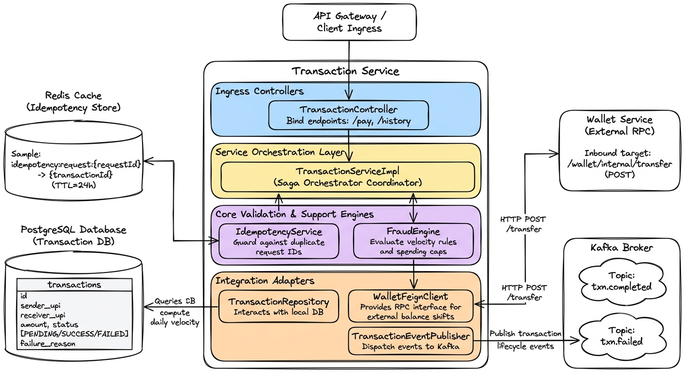

# 🔴 Transaction Service & Saga: Intensive System Design & Interview Guide

The **Transaction Service** (Port 8083) manages the payment lifecycle. It uses a **Local Saga Orchestrator** to coordinate updates across services, Redis to enforce idempotency, and a **Fraud Engine** to validate transaction limits.

---

## 🗺️ 1. Core Architecture, Saga Orchestration, & Database Schema

The Transaction Service uses **Redis** for fast, atomic idempotency checks and a **PostgreSQL** database to persist transaction states.



### 🗄️ Database Schema & Indexes (PostgreSQL DDL)

```sql
-- Create transactions table
CREATE TABLE transactions (
    id UUID PRIMARY KEY DEFAULT gen_random_uuid(),
    sender_upi_id VARCHAR(50) NOT NULL,
    receiver_upi_id VARCHAR(50) NOT NULL,
    amount NUMERIC(15, 2) NOT NULL,
    status VARCHAR(20) NOT NULL DEFAULT 'PENDING',
    failure_reason VARCHAR(255),
    note VARCHAR(255),
    created_at TIMESTAMP WITH TIME ZONE NOT NULL DEFAULT NOW(),
    updated_at TIMESTAMP WITH TIME ZONE NOT NULL DEFAULT NOW()
);

-- Index sender_upi_id and receiver_upi_id to optimize transaction history lookups
CREATE INDEX idx_txn_sender ON transactions(sender_upi_id);
CREATE INDEX idx_txn_receiver ON transactions(receiver_upi_id);
-- Compound index on sender and created_at to optimize daily velocity calculations in the Fraud Engine
CREATE INDEX idx_txn_sender_velocity ON transactions(sender_upi_id, created_at, status);
```

### ⚡ Redis Idempotency Schema
- **Key Structure**: `idempotency:request:{requestId}`
- **Value**: `{transactionId}` (stores the UUID of the initialized transaction)
- **TTL**: `86400` seconds (24 hours) to prevent Redis memory leaks while protecting against duplicate retries within the same day.

---

## 🔄 2. Step-by-Step Saga Orchestration Flow

Instead of blocking databases with a resource-heavy **Two-Phase Commit (2PC)**, we use a **Local Saga Orchestrator**. The orchestrator manages distributed consistency by executing local transactions sequentially and running compensating actions if a step fails.

```
       [Client Request]
              │
              ▼
    [Idempotency Check] ────── (Redis key exists?) ──────► [Replay Response]
              │
          (New Request)
              ▼
    [Save PENDING Status] ──► (Persist to PostgreSQL)
              │
              ▼
     [Fraud Engine Check] ─── (Daily Limit / Single Cap)
              │
              ▼
     [Wallet Feign RPC] ───── (Post HTTP /transfer)
        │           │
     (200 OK)    (Fail/Timeout)
        │           │
        ▼           ▼
   [SUCCESS]     [FAILED] ─── (Compensating Step: Save Failure Reason)
        │           │
        ▼           ▼
    [Kafka: completed]  [Kafka: failed]
```

### Flow Steps
1. **Ingress & Lock**: A client sends a transaction request containing `senderUpiId`, `toUpiId`, `amount`, and `requestId`.
2. **Idempotency Guard**:
   - Calls `redisTemplate.opsForValue().setIfAbsent("idempotency:request:" + requestId, "RESERVED", Duration.ofMinutes(1))`.
   - If `setIfAbsent` returns `false`, another request with the same ID is already processing. The client receives a duplicate request error.
3. **Initialize state**: Saves a `Transaction` entity in PostgreSQL with `status = PENDING`.
4. **Fraud Verification**:
   - Compares the request amount to the maximum single transaction limit (e.g., ₹10,000).
   - Queries the database for the sum of successful transactions sent by the user today:
     `SELECT SUM(amount) FROM transactions WHERE sender_upi_id = ? AND status = 'SUCCESS' AND created_at >= CURRENT_DATE;`
   - If the sum exceeds the daily limit (e.g., ₹50,000), throws a `FraudVelocityException`.
5. **Execute RPC**: Calls `/wallet/internal/transfer` via OpenFeign.
6. **Commit State**:
   - **On Success**: Updates the transaction status to `SUCCESS` in PostgreSQL, updates the Redis key value to the transaction ID, and publishes a `txn.completed` event to Kafka.
   - **On Failure**: Updates the transaction status to `FAILED` in PostgreSQL, records the failure reason, and publishes a `txn.failed` event to Kafka.

---

## 🛑 3. Detailed Negative Scenarios & Failures

### Scenario A: Concurrent Request Submissions (Race Condition)
- **Trigger**: A client clicks the pay button twice at the same millisecond, sending two identical requests with the same `requestId` simultaneously.
- **Sequence**:
  1. Request A and Request B reach the Transaction Service instances.
  2. Request A runs `setIfAbsent` in Redis. Redis executes this atomically, writes the key, and returns `true`.
  3. Request B runs `setIfAbsent` for the same key. Redis returns `false`.
- **Result**: Request A proceeds to execute the transaction. Request B is rejected immediately with a `409 Conflict` (or duplicates are replayed if Request A has already completed), preventing double charging.

### Scenario B: Fraud Velocity Limit Triggered
- **Trigger**: A user attempts to send ₹5,000, but their transaction history shows they have already sent ₹48,000 today, exceeding the ₹50,000 daily limit.
- **Handling**: The `FraudEngine` checks the daily limit, calculates the projected total (₹53,000), and throws a `FraudVelocityException`.
- **Result**: The orchestrator catches the exception, updates the transaction status to `FAILED` with the reason `DAILY_LIMIT_EXCEEDED`, and returns a `422 Unprocessable Entity` response. No calls are made to the Wallet Service.

### Scenario C: Feign Client Read Timeout (Partial Failure State)
- **Trigger**: The Transaction Service calls the Wallet Service. The Wallet Service processes the transfer and updates the databases, but a network issue prevents the response from reaching the Transaction Service before the read timeout expires.
- **Failure Sequence**:
  1. The Transaction Service's Feign client throws a `ReadTimeoutException`.
  2. The orchestrator's catch block runs.
  3. Since the orchestrator does not know if the transfer completed, it updates the transaction status to `FAILED` and records the reason as `TIMEOUT`.
  4. The orchestrator publishes a `txn.failed` event.
- **State Discrepancy**: The Wallet database shows the transfer succeeded, but the Transaction database shows it failed.
- **Reconciliation**:
  - The client retries the request using the same `requestId`.
  - The Transaction Service intercepts the retry, queries the Wallet Service to check if the transaction ID exists in its ledger, finds the ledger entries, corrects the transaction status to `SUCCESS`, and resolves the discrepancy.

---

## 💻 4. Code Snippets: Implementation Details

### Saga Orchestrator (`TransactionService.java`)
```java
@Service
@RequiredArgsConstructor
@Slf4j
public class TransactionService {

    private final TransactionRepository transactionRepository;
    private final IdempotencyService idempotencyService;
    private final FraudEngine fraudEngine;
    private final WalletFeignClient walletFeignClient;
    private final TransactionEventPublisher eventPublisher;

    @Transactional(rollbackFor = Exception.class)
    public PayResponse processPayment(PayRequest request, String senderUpiId) {
        String requestId = request.getRequestId();

        // 1. Enforce Idempotency
        Optional<String> cachedTxn = idempotencyService.getExistingResult(requestId);
        if (cachedTxn.isPresent()) {
            Transaction existing = transactionRepository.findById(UUID.fromString(cachedTxn.get()))
                    .orElseThrow(() -> new IllegalStateException("Idempotency key mapping mismatch"));
            log.info("Duplicate request detected for requestId={}. Replaying transaction status={}", requestId, existing.getStatus());
            return toResponse(existing, true);
        }

        // 2. Initialize PENDING Transaction in Database
        Transaction txn = Transaction.builder()
                .senderUpiId(senderUpiId)
                .receiverUpiId(request.getToUpiId())
                .amount(request.getAmount())
                .status(TransactionStatus.PENDING)
                .note(request.getNote())
                .build();
        txn = transactionRepository.save(txn);
        
        // Lock the request ID in Redis
        idempotencyService.storeResult(requestId, txn.getId().toString());

        try {
            // 3. Run Fraud Velocity Checks
            fraudEngine.validate(senderUpiId, request.getToUpiId(), request.getAmount());

            // 4. Call Wallet Service via Feign RPC
            TransferRequest transferRequest = TransferRequest.builder()
                    .transactionId(txn.getId())
                    .fromUpiId(senderUpiId)
                    .toUpiId(request.getToUpiId())
                    .amount(request.getAmount())
                    .note(request.getNote())
                    .build();

            walletFeignClient.transfer(transferRequest);

            // 5. Update Status to SUCCESS
            txn.setStatus(TransactionStatus.SUCCESS);
            transactionRepository.save(txn);

            // 6. Publish Success Event
            eventPublisher.publishCompleted(txn);

        } catch (Exception ex) {
            log.error("Payment transaction failed for txnId={}, running compensating steps. Error: {}", txn.getId(), ex.getMessage());
            
            // Compensating Step: Update local status to FAILED
            txn.setStatus(TransactionStatus.FAILED);
            txn.setFailureReason(ex.getMessage());
            transactionRepository.save(txn);

            // Publish Failure Event
            eventPublisher.publishFailed(txn);
        }

        return toResponse(txn, false);
    }
}
```

### Fraud Engine Velocity Checker (`FraudEngine.java`)
```java
@Component
@RequiredArgsConstructor
public class FraudEngine {

    private final TransactionRepository transactionRepository;
    private static final BigDecimal MAX_SINGLE_TXN = new BigDecimal("10000.00");
    private static final BigDecimal MAX_DAILY_LIMIT = new BigDecimal("50000.00");

    public void validate(String senderUpi, String receiverUpi, BigDecimal amount) {
        // Rule 1: Prevent self-transfers
        if (senderUpi.equalsIgnoreCase(receiverUpi)) {
            throw new FraudViolationException("Self-transfers are not allowed");
        }

        // Rule 2: Enforce single transaction limit
        if (amount.compareTo(MAX_SINGLE_TXN) > 0) {
            throw new FraudViolationException("Transaction amount exceeds single transfer limit of " + MAX_SINGLE_TXN);
        }

        // Rule 3: Enforce daily cumulative limit
        BigDecimal spentToday = transactionRepository.getSumOfSuccessfulTxnsForToday(senderUpi)
                .orElse(BigDecimal.ZERO);
        
        BigDecimal projectedTotal = spentToday.add(amount);
        if (projectedTotal.compareTo(MAX_DAILY_LIMIT) > 0) {
            throw new FraudVelocityException("Transaction would exceed daily cumulative spending limit of " + MAX_DAILY_LIMIT);
        }
    }
}
```

---

## 🎨 5. Excalidraw Prompt: Entire Transaction Service Architecture & Flow
> **Excalidraw Prompt:** 
> Create a comprehensive, professional system architecture and flow diagram of the Transaction Service in a clean, hand-drawn Excalidraw style.
> 
> **Layout & Boxes:**
> 1. **Top Center: API Gateway / Client Ingress**
>    - Draw a rounded rectangle labeled "API Gateway / Client Ingress".
>    - Draw a solid downward arrow pointing from this to the Transaction Controller.
> 
> 2. **Center: Transaction Service Container**
>    - Draw a large vertical rectangular container labeled "Transaction Service".
>    - Inside it, divide the space into 4 stacked horizontal layers:
>      - **Layer 1: Ingress Controllers** (Fill color: Pastel Blue). Inside, place: "TransactionController" (binds endpoints like `/pay` and `/history`).
>      - **Layer 2: Service Orchestration Layer** (Fill color: Pastel Yellow). Inside, place a large block: "TransactionServiceImpl (Saga Orchestrator Coordinator)".
>      - **Layer 3: Core Validation & Support Engines** (Fill color: Pastel Purple). Inside, place two sub-boxes:
>        - "IdempotencyService" (guards against duplicate request IDs).
>        - "FraudEngine" (evaluates velocity rules & spending caps).
>      - **Layer 4: Integration Adapters** (Fill color: Pastel Orange). Inside, place three nested rectangles:
>        - "TransactionRepository" (interacts with the local DB).
>        - "WalletFeignClient" (RPC interface for external balance shifts).
>        - "TransactionEventPublisher" (dispatches events to Kafka).
> 
> 3. **Left Side: Redis Cache & PostgreSQL DB**
>    - **Top Left: Redis Cache Cylinder**
>      - Draw a cylinder labeled "Redis Cache (Idempotency Store)". Show a sample key entry: `idempotency:request:{requestId} -> {transactionId} (TTL=24h)`.
>    - **Bottom Left: PostgreSQL Database Cylinder**
>      - Draw a cylinder labeled "PostgreSQL Database (Transaction DB)". Draw a table inside labeled "transactions" (columns: id, sender_upi, receiver_upi, amount, status [PENDING/SUCCESS/FAILED], failure_reason).
> 
> 4. **Right Side: Downstream Integrations**
>    - **Top Right: External Wallet Service Box**
>      - Draw a rectangular container labeled "Wallet Service (External RPC)". Show an inbound target: `/wallet/internal/transfer` (POST).
>    - **Bottom Right: Kafka Broker Box**
>      - Draw a rectangle labeled "Kafka Broker". Inside, draw two cloud shapes representing topics: "Topic: txn.completed" and "Topic: txn.failed".
> 
> **Connections & Arrows:**
> - Draw a downward arrow from "TransactionController" (Layer 1) to "TransactionServiceImpl" (Layer 2).
> - Draw bi-directional interaction arrows from "TransactionServiceImpl" (Layer 2) to:
>   - "IdempotencyService" (Layer 3) which in turn connects to the "Redis Cache" cylinder on the left.
>   - "FraudEngine" (Layer 3) which queries the local "PostgreSQL Transaction DB" cylinder on the bottom left to compute daily velocity.
> - Draw solid output arrows from the Integration Adapters (Layer 4) to their external targets:
>   - From "TransactionRepository" to the local "PostgreSQL Database".
>   - From "WalletFeignClient" to the external "Wallet Service" box on the top right. Label the line: "HTTP POST /transfer".
>   - From "TransactionEventPublisher" to the "Kafka Broker" clouds on the bottom right. Label the line: "Publish transaction lifecycle events".
> 
> **Styling & Aesthetics:**
> - Use handwritten-style fonts (like Excalidraw's default).
> - Apply subtle borders with a hand-drawn wave effect.
> - Color-code the layers with distinct pastel fills.

