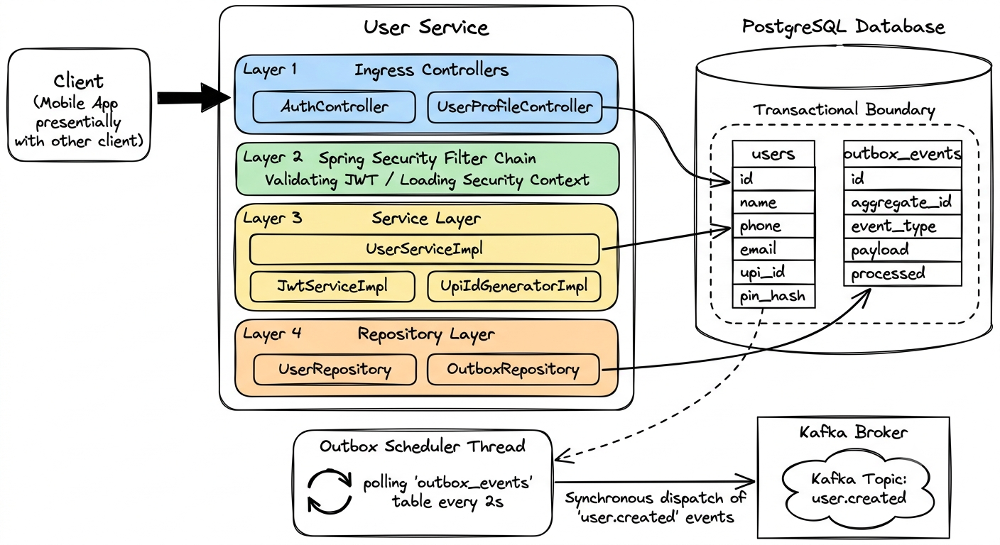

# 👤 User Service & Identity: Intensive System Design & Interview Guide

The **User Service** (Port 8081) manages user identities, login credentials, security parameters, and payment addresses (VPA). It is the gateway to registration and JWT issuance. This guide covers its complete architecture, database schemas, processing lifecycles, and negative scenarios.

---

## 🗺️ 1. Core Architecture, Spring Security, & Database Schema

The User Service is built on standard Spring Boot, Spring Security (servlet-based), and JPA/PostgreSQL. It communicates event updates using the **Transactional Outbox Pattern** to preserve database-broker consistency.



### 🗄️ Database Schema & Indexes (PostgreSQL DDL)

To guarantee indexing performance under high user-query load, specific indexes are set up on the primary keys and query columns:

```sql
-- Create users table
CREATE TABLE users (
    id UUID PRIMARY KEY DEFAULT gen_random_uuid(),
    full_name VARCHAR(100) NOT NULL,
    phone VARCHAR(15) NOT NULL UNIQUE,
    email VARCHAR(100) UNIQUE,
    upi_id VARCHAR(50) NOT NULL UNIQUE,
    pin_hash VARCHAR(255) NOT NULL,
    is_active BOOLEAN NOT NULL DEFAULT TRUE,
    created_at TIMESTAMP WITH TIME ZONE NOT NULL DEFAULT NOW(),
    updated_at TIMESTAMP WITH TIME ZONE NOT NULL DEFAULT NOW()
);

-- Unique index on upi_id to optimize verification routing and cross-service queries
CREATE UNIQUE INDEX idx_users_upi_id ON users(upi_id);
-- Index on phone for fast authentication lookups
CREATE INDEX idx_users_phone ON users(phone);

-- Create outbox_events table
CREATE TABLE outbox_events (
    id UUID PRIMARY KEY DEFAULT gen_random_uuid(),
    aggregate_id VARCHAR(255) NOT NULL,
    aggregate_type VARCHAR(50) NOT NULL,
    event_type VARCHAR(100) NOT NULL,
    payload TEXT NOT NULL,
    processed BOOLEAN NOT NULL DEFAULT FALSE,
    created_at TIMESTAMP WITH TIME ZONE NOT NULL DEFAULT NOW(),
    processed_at TIMESTAMP WITH TIME ZONE
);

-- Compound index to allow the Outbox Poller to quickly locate unprocessed events
CREATE INDEX idx_outbox_unprocessed ON outbox_events(processed, created_at ASC);
```

### 🔑 Cryptographic Controls & Credentials
- **PIN Hashing**: BCrypt is used via `BCryptPasswordEncoder`. It applies a salted hash function dynamically with a configured work factor of `12` rounds, protecting the 4-digit PIN from brute force and lookup table attacks.
- **UPI ID Generation**: Generated by taking the lowercase name, removing special characters, and appending `@miniupi`. If a collision occurs (e.g. `sachin@miniupi` already exists), a suffix deduplication checker queries the database and appends sequential integers (`sachin1@miniupi`, `sachin2@miniupi`).
- **JWT Signature**: Tokens are signed using **HMAC-SHA256** using a minimum 256-bit secure secret key. The token payload contains:
  - Subject (`userId` UUID string)
  - Claim: `upiId`
  - Claim: `phone`
  - Issued At & Expiration timestamps (configured to 24 hours).

---

## 🔄 2. Step-by-Step System Execution Flows

### Flow A: User Registration & Outbox Creation (Synchronous Write Path)
1. **Client Submission**: Client sends payload `{ fullName, phone, email, pin }` to gateway, proxied to `POST /api/users/register`.
2. **Pre-Checks**: 
   - `UserServiceImpl` calls `UserRepository.existsByPhone(phone)`.
   - Generates UPI ID by checking name availability in `users` table.
3. **Password Encoding**: Compiles the PIN using `passwordEncoder.encode(pin)`.
4. **Transaction Boundary Initiation**:
   - Opens standard Spring/JPA transactional context (`@Transactional`).
   - Inserts User entity to database `users` table.
   - Constructs a `UserCreatedEvent` payload containing `userId`, `upiId`, `phone`, and `fullName`.
   - Serializes payload to JSON using `Jackson ObjectMapper`.
   - Inserts OutboxEvent entity to `outbox_events` table with `processed = false`.
   - **Transaction Commits**: Both records persist atomically. If either fails, database changes roll back.
5. **Token Generation**: Generates JWT token with the active claims.
6. **HTTP Response**: Returns `201 Created` with payload containing token and UPI ID.

### Flow B: Event Propagation (Asynchronous Polling & Dispatch Path)
1. **Trigger**: An `@Scheduled(fixedDelay = 2000)` scheduler invokes `processOutboxEvents()` inside `OutboxScheduler`.
2. **Database Query**: Queries the `outbox_events` table using index `idx_outbox_unprocessed` to fetch a list of unprocessed records:
   `SELECT * FROM outbox_events WHERE processed = false ORDER BY created_at ASC LIMIT 50;`
3. **Kafka Dispatch**: For each pending event:
   - Deserializes the JSON payload back into its event model (`UserCreatedEvent.class`).
   - Calls the `UserEventPublisher` to push the event to Kafka topic `user.created`.
   - The publisher calls `kafkaTemplate.send(...)` and executes a blocking `.get()` on the returned `CompletableFuture` to block the thread until the Kafka broker issues an acknowledgment (ACK).
4. **Commit processed state**:
   - Once Kafka ACK is received, updates the record's `processed` status to `true` and sets `processed_at = Instant.now()`.
   - Saves the updated entity, committing the state change back to PostgreSQL.

---

## 🛑 3. Detailed Negative Scenarios & Failures

### Scenario A: Duplicate Registration Attempt (Database Conflict)
- **Failure Cause**: Client attempts to register with a phone number that is already in use, or two concurrent registration requests for the same phone number bypass the application checks at the same millisecond.
- **Rollback Sequence**:
  1. The unique database constraint `UNIQUE(phone)` triggers a `ConstraintViolationException` during save.
  2. Spring catches the SQL error and marks the current `@Transactional` context as rollback-only.
  3. No record is added to either `users` or `outbox_events` tables.
- **Handling**: Caught by `GlobalExceptionHandler`, throwing a `409 Conflict` response with error details:
  ```json
  {
    "status": 409,
    "error": "CONFLICT",
    "message": "User with this phone number already exists",
    "code": "USER_ALREADY_EXISTS"
  }
  ```

### Scenario B: JSON Serialization Failures
- **Failure Cause**: Unexpected payload mapping issue or null fields cause `ObjectMapper.writeValueAsString()` to throw a `JsonProcessingException` when compiling the `OutboxEvent` payload.
- **Rollback Sequence**:
  1. Exception is caught within the registration method wrapper.
  2. Since it occurs inside the `@Transactional` scope, the transaction is marked for rollback.
  3. No partial record of the user is committed to PostgreSQL.
- **Handling**: The method throws a custom `OutboxSerializationException`, returning a `500 Internal Server Error` to the client.

### Scenario C: Kafka Broker Outage (Event Recovery Flow)
- **Failure Cause**: The scheduler queries PostgreSQL and retrieves 10 unprocessed outbox records, but the Kafka cluster is down or partitioned.
- **Failure Sequence**:
  1. The `kafkaTemplate.send` operation times out or throws an `ExecutionException` because it cannot reach the broker bootstrap servers.
  2. The exception is caught inside the loop in `OutboxScheduler`.
  3. The `processed` flag is **not** set to `true`.
  4. The background database update transaction is rolled back.
  5. The client's registration remains valid (they received their JWT token during Flow A), but downstream services do not receive the event.
- **Recovery**: The scheduler runs again 2 seconds later. It reads the same unprocessed records and attempts the Kafka send again. Once Kafka recovers, the events are successfully published and processed.

### Scenario D: Scheduler Node Crashes Mid-Execution
- **Failure Cause**: The scheduler successfully publishes a `user.created` event to Kafka, but the service container is killed or loses power before it can update the outbox record in PostgreSQL.
- **Failure Sequence**:
  1. The Kafka broker already has the message in the partition.
  2. Since the server died before setting `processed = true`, the database state shows the event is still pending.
  3. When the service restarts, the new scheduler instance queries the database, finds the event, and publishes it to Kafka again.
- **Result**: Kafka receives a duplicate message. This represents **At-Least-Once Delivery**. The downstream consumer (Wallet Service) must handle this deduplication.

---

## 💻 4. Code Snippets: Implementation Details

### User Registration implementation with Transaction Boundary (`UserServiceImpl.java`)
```java
@Service
@RequiredArgsConstructor
@Slf4j
public class UserServiceImpl implements UserService {

    private final UserRepository userRepository;
    private final OutboxEventRepository outboxRepository;
    private final BCryptPasswordEncoder passwordEncoder;
    private final UpiIdGenerator upiIdGenerator;
    private final JwtService jwtService;
    private final ObjectMapper objectMapper;

    @Override
    @Transactional(rollbackFor = Exception.class)
    public AuthResponse register(RegisterRequest req) {
        log.info("Initiating registration for phone={}", req.getPhone());
        
        // 1. Verify availability
        if (userRepository.existsByPhone(req.getPhone())) {
            throw new UserAlreadyExistsException("Phone number already registered");
        }

        // 2. Generate unique UPI VPA
        String upiId = upiIdGenerator.generate(req.getFullName());

        // 3. Construct and encrypt credentials
        User user = User.builder()
                .fullName(req.getFullName())
                .phone(req.getPhone())
                .email(req.getEmail())
                .upiId(upiId)
                .pinHash(passwordEncoder.encode(req.getPin()))
                .isActive(true)
                .build();

        // 4. Save User record
        User savedUser = userRepository.save(user);

        // 5. Construct and Save Outbox event record within same transaction
        UserCreatedEvent eventPayload = UserCreatedEvent.builder()
                .userId(savedUser.getId())
                .upiId(savedUser.getUpiId())
                .fullName(savedUser.getFullName())
                .phone(savedUser.getPhone())
                .createdAt(savedUser.getCreatedAt())
                .build();

        try {
            OutboxEvent outbox = OutboxEvent.builder()
                    .aggregateId(savedUser.getId().toString())
                    .aggregateType("User")
                    .eventType("user.created")
                    .payload(objectMapper.writeValueAsString(eventPayload))
                    .processed(false)
                    .build();

            outboxRepository.save(outbox);
        } catch (JsonProcessingException e) {
            log.error("Failed serialization of outbox model payload for user={}", savedUser.getId(), e);
            throw new OutboxSerializationException("Failed to serialize outbox event payload", e);
        }

        // 6. Return response with JWT
        String token = jwtService.generateToken(savedUser.getId(), savedUser.getUpiId(), savedUser.getPhone());
        return AuthResponse.of(token, savedUser.getUpiId(), savedUser.getFullName());
    }
}
```

### Outbox Background Scheduler Process (`OutboxScheduler.java`)
```java
@Component
@EnableScheduling
@RequiredArgsConstructor
@Slf4j
public class OutboxScheduler {

    private final OutboxEventRepository outboxRepository;
    private final UserEventPublisher eventPublisher;
    private final ObjectMapper objectMapper;

    @Scheduled(fixedDelay = 2000)
    public void processPendingEvents() {
        // Fetch up to 50 unprocessed events sequentially
        List<OutboxEvent> pending = outboxRepository.findByProcessedFalseOrderByCreatedAtAsc(PageRequest.of(0, 50));
        
        if (pending.isEmpty()) {
            return;
        }

        log.info("Processing {} outbox events", pending.size());

        for (OutboxEvent event : pending) {
            // Apply single transaction boundary per event to prevent blocking the entire batch on a single failure
            try {
                processEvent(event);
            } catch (Exception e) {
                log.error("Failed processing outbox record id={}: {}", event.getId(), e.getMessage(), e);
                // The event remains processed=false and will be retried in the next poll loop
            }
        }
    }

    @Transactional(rollbackFor = Exception.class)
    public void processEvent(OutboxEvent event) throws Exception {
        if ("user.created".equals(event.getEventType())) {
            UserCreatedEvent payload = objectMapper.readValue(event.getPayload(), UserCreatedEvent.class);
            
            // Synchronous write blocking send to Kafka broker
            eventPublisher.publishUserCreated(payload);
            
            // Update PostgreSQL state on successful acknowledgment
            event.setProcessed(true);
            event.setProcessedAt(Instant.now());
            outboxRepository.save(event);
        } else {
            log.warn("Unknown event type={} for outbox id={}", event.getEventType(), event.getId());
            event.setProcessed(true); // Discard unknown event
            outboxRepository.save(event);
        }
    }
}
```

---

## 🎨 5. Excalidraw Prompt: Entire User Service Architecture & Flow
> **Excalidraw Prompt:** 
> Create a detailed, professional system architecture diagram of the User Service in a clean, hand-drawn Excalidraw style. 
> 
> **Layout & Boxes:**
> 1. **Left Side: Client Box**
>    - Create a rounded rectangle labeled "Client (Mobile App presentially with other client)".
>    - Draw a bold, filled block arrow pointing from this box to Layer 1 of the User Service.
> 
> 2. **Center: User Service Container**
>    - Draw a large vertical rectangular container labeled "User Service".
>    - Inside it, divide the space into 4 stacked horizontal layers (Layer 1 at the top, Layer 4 at the bottom):
>      - **Layer 1: Ingress Controllers** (Fill color: Pastel Blue). Inside, place two nested rectangles: "AuthController" and "UserProfileController".
>      - **Layer 2: Spring Security Filter Chain** (Fill color: Pastel Green). Label it: "Spring Security Filter Chain / Validating JWT / Loading Security Context".
>      - **Layer 3: Service Layer** (Fill color: Pastel Yellow). Inside, place three nested rectangles: "UserServiceImpl", "JwtServiceImpl", and "UpiIdGeneratorImpl".
>      - **Layer 4: Repository Layer** (Fill color: Pastel Orange). Inside, place two nested rectangles: "UserRepository" and "OutboxRepository".
> 
> 3. **Right Side: PostgreSQL Database**
>    - Draw a tall cylinder/container labeled "PostgreSQL Database".
>    - Inside it, draw a dashed bounding box representing the "Transactional Boundary".
>    - Inside the boundary, draw two vertical tables (drawn as grids/columns):
>      - Table 1: "users" (draw rows representing fields: id, name, phone, email, upi_id, pin_hash).
>      - Table 2: "outbox_events" (draw rows representing fields: id, aggregate_id, event_type, payload, processed).
> 
> 4. **Bottom Center: Outbox Scheduler Thread**
>    - Below the User Service container, draw a rounded rectangle labeled "Outbox Scheduler Thread".
>    - Inside it, draw a circular refresh/loop arrow on the left, labeled: "polling 'outbox_events' table every 2s".
>    - Draw a solid connection arrow pointing from this thread to the Kafka Broker.
> 
> 5. **Bottom Right: Kafka Broker**
>    - Draw a rectangle labeled "Kafka Broker".
>    - Inside it, draw a cloud shape labeled "Kafka Topic: user.created".
> 
> **Connections & Arrows:**
> - Draw a curved arrow from "UserProfileController" (Layer 1) pointing to the "users" table in the Database.
> - Draw an arrow from "UserServiceImpl" (Layer 3) to the "users" table.
> - Draw an arrow from the "OutboxRepository" (Layer 4) pointing to the "outbox_events" table.
> - Draw a dashed arrow from the "users" table to the "Outbox Scheduler Thread" to represent database updates.
> - Label the arrow from the Outbox Scheduler to the Kafka Topic: "Synchronous dispatch of 'user.created' events".
> 
> **Styling & Aesthetics:**
> - Use handwritten-style fonts (like Excalidraw's default).
> - Apply subtle borders with a hand-drawn wave effect.
> - Color-code the layers with distinct pastel fills.

