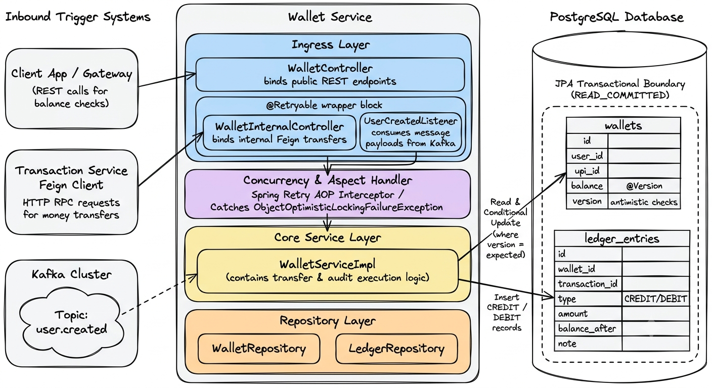

# 🟢 Wallet Service & Ledger: Intensive System Design & Interview Guide

The **Wallet Service** (Port 8082) manages wallet accounts, processes balance adjustments, and stores financial ledger entries. It uses a **Double-Entry Ledger** architecture and handles concurrent transactions using **JPA Optimistic Locking**.

---

## 🗺️ 1. Core Architecture, Ledger Design, & Database Schema

Every balance change requires an audit record. Balance reads fetch from the `wallets` table, but the **Ledger** table serves as the immutable history.



### 🗄️ Database Schema & Indexes (PostgreSQL DDL)

To support transactional integrity and auditing, we define the following tables:

```sql
-- Create wallets table
CREATE TABLE wallets (
    id UUID PRIMARY KEY DEFAULT gen_random_uuid(),
    user_id UUID NOT NULL UNIQUE,
    upi_id VARCHAR(50) NOT NULL UNIQUE,
    balance NUMERIC(15, 2) NOT NULL DEFAULT 0.00,
    version BIGINT NOT NULL DEFAULT 0,
    created_at TIMESTAMP WITH TIME ZONE NOT NULL DEFAULT NOW(),
    updated_at TIMESTAMP WITH TIME ZONE NOT NULL DEFAULT NOW()
);

-- Index user_id for fast cross-service lookups from User and Transaction services
CREATE INDEX idx_wallets_user_id ON wallets(user_id);
-- Unique index on upi_id to optimize balance inquiries and transfers
CREATE UNIQUE INDEX idx_wallets_upi_id ON wallets(upi_id);

-- Create ledger_entries table
CREATE TABLE ledger_entries (
    id UUID PRIMARY KEY DEFAULT gen_random_uuid(),
    wallet_id UUID NOT NULL REFERENCES wallets(id) ON DELETE RESTRICT,
    transaction_id UUID,
    type VARCHAR(10) NOT NULL, -- 'CREDIT' or 'DEBIT'
    amount NUMERIC(15, 2) NOT NULL,
    balance_after NUMERIC(15, 2) NOT NULL,
    note VARCHAR(255),
    created_at TIMESTAMP WITH TIME ZONE NOT NULL DEFAULT NOW()
);

-- Index transaction_id to enable quick audits for specific transactions
CREATE INDEX idx_ledger_transaction_id ON ledger_entries(transaction_id);
-- Index wallet_id to speed up history queries
CREATE INDEX idx_ledger_wallet_id ON ledger_entries(wallet_id);
```

### 💸 Double-Entry Ledger Principles
1. **No Direct Overwrites**: Balance values are only updated alongside the insertion of ledger records.
2. **Conservation of Value**: In any P2P transfer, the sum of debits must equal the sum of credits:
   $$\text{Debit Amount (Sender)} = \text{Credit Amount (Receiver)}$$
3. **Audit Equation**: A wallet's current balance must match the sum of its credit entries minus the sum of its debit entries:
   $$\text{balance} = \sum \text{LedgerEntry(CREDIT)} - \sum \text{LedgerEntry(DEBIT)}$$
   Discrepancies indicate data corruption or tampering.

### 🔒 Concurrency Strategy: JPA Optimistic Locking
Optimistic locking avoids database lock contention. The `@Version` annotation maps to the `version` column in the database:
- When reading a record, JPA loads its current version number.
- When committing updates, Hibernate automatically appends a version check to the SQL query:
  `UPDATE wallets SET balance = ?, version = version + 1 WHERE id = ? AND version = ?;`
- If another thread updated the row since the read, the query updates `0` rows. JPA detects this and throws an `ObjectOptimisticLockingFailureException`. The application catches the exception and retries the operation.

---

## 🔄 2. Step-by-Step Execution Flows

### Flow A: Wallet Creation (Asynchronous Event Path)
1. **Ingress**: `UserCreatedListener` consumes a `user.created` event from Kafka.
2. **Read Verification**: Checks the database by `userId` to verify if a wallet already exists.
3. **Creation**: If the wallet does not exist, saves a new `Wallet` record with `balance = 0.00` and `version = 0`.
4. **Log**: Records the execution.

### Flow B: P2P Atomic Transfer (Synchronous RPC Path)
1. **RPC Request**: The Transaction Service sends a payload containing `transactionId`, `fromUpiId`, `toUpiId`, and `amount` to `POST /wallet/internal/transfer`.
2. **Open Transaction**: Opens a `@Transactional` block with isolation level `Isolation.READ_COMMITTED`.
3. **Read Sender**: Fetches the sender's wallet from PostgreSQL.
4. **Validation**: Confirms the sender has sufficient funds (`balance >= amount`).
5. **Read Receiver**: Fetches the receiver's wallet.
6. **Debit Sender**: Subtracts the amount from the sender's balance and saves the wallet.
7. **Credit Receiver**: Adds the amount to the receiver's balance and saves the wallet.
8. **Write Ledger**: Saves a `DEBIT` ledger entry for the sender and a `CREDIT` ledger entry for the receiver, linking both to the `transactionId`.
9. **Transaction Commit**:
   - JPA executes the updates, running the SQL version check queries.
   - If the version check succeeds, both updates are committed, and the method returns `200 OK`.
   - If a version mismatch occurs, the database transaction rolls back, and an `ObjectOptimisticLockingFailureException` is thrown.

---

## 🛑 3. Detailed Negative Scenarios & Failures

### Scenario A: Insufficient Funds
- **Trigger**: A user attempts to transfer ₹50.00, but their wallet balance is ₹10.00.
- **Handling**: `WalletService` compares the balance to the requested amount and throws `InsufficientFundsException`.
- **Result**: The transaction rolls back. The service returns a `400 Bad Request` with the error code `INSUFFICIENT_FUNDS`. No ledger entries are written, and no balances are changed.

### Scenario B: Optimistic Locking Collision
- **Trigger**: Two parallel processes attempt to debit a single wallet at the same time (e.g., automated payments).
- **Sequence**:
  1. Thread A reads Wallet (Bal = ₹100, Version = 2).
  2. Thread B reads Wallet (Bal = ₹100, Version = 2).
  3. Thread A deducts ₹10 and updates: `SET balance = 90, version = 3 WHERE version = 2`. This succeeds.
  4. Thread B deducts ₹20 and updates: `SET balance = 80, version = 3 WHERE version = 2`.
  5. The database returns `0` updated rows for Thread B because the version is now `3`.
  6. Spring throws `ObjectOptimisticLockingFailureException`.
- **Resolution**: The exception is caught by a retry wrapper. The wrapper re-runs the transfer method, which re-reads the updated wallet (now with Bal = ₹90, Version = 3) and executes the transaction successfully.

### Scenario C: Wallet Lookup Failure (Invalid UPI ID)
- **Trigger**: A transfer is requested to an invalid or deleted UPI ID.
- **Handling**: `walletRepository.findByUpiId` returns `Optional.empty()`. The service throws `WalletNotFoundException`.
- **Result**: The transaction rolls back. The sender is not charged, and the Feign client returns a `404 Not Found` with the code `WALLET_NOT_FOUND`.

### Scenario D: Broker Duplicates (At-Least-Once Delivery Handling)
- **Trigger**: Kafka delivers a duplicate `user.created` event due to a network timeout before the offset commit.
- **Handling**: `onUserCreated` checks `walletRepository.existsByUserId(userId)`.
- **Result**: Since the check returns `true`, the event is logged as a duplicate and skipped. This prevents unique constraint violations or database errors.

---

## 💻 4. Code Snippets: Implementation Details

### Wallet and Ledger Transaction Logic (`WalletService.java`)
```java
@Service
@RequiredArgsConstructor
@Slf4j
public class WalletService {

    private final WalletRepository walletRepository;
    private final LedgerRepository ledgerRepository;

    @Transactional(rollbackFor = Exception.class)
    public void transfer(TransferRequest req) {
        log.info("Processing transfer request: txnId={}, from={}, to={}, amount={}",
                req.getTransactionId(), req.getFromUpiId(), req.getToUpiId(), req.getAmount());

        // 1. Fetch and validate sender
        Wallet sender = walletRepository.findByUpiId(req.getFromUpiId())
                .orElseThrow(() -> new WalletNotFoundException("Sender wallet not found"));

        if (sender.getBalance().compareTo(req.getAmount()) < 0) {
            throw new InsufficientFundsException("Insufficient balance in sender wallet");
        }

        // 2. Fetch receiver
        Wallet receiver = walletRepository.findByUpiId(req.getToUpiId())
                .orElseThrow(() -> new WalletNotFoundException("Receiver wallet not found"));

        // 3. Debit sender
        BigDecimal newSenderBal = sender.getBalance().subtract(req.getAmount());
        sender.setBalance(newSenderBal);
        walletRepository.save(sender); // Updates row and verifies version

        ledgerRepository.save(LedgerEntry.builder()
                .walletId(sender.getId())
                .transactionId(req.getTransactionId())
                .type(LedgerEntry.EntryType.DEBIT)
                .amount(req.getAmount())
                .balanceAfter(newSenderBal)
                .note(req.getNote())
                .build());

        // 4. Credit receiver
        BigDecimal newReceiverBal = receiver.getBalance().add(req.getAmount());
        receiver.setBalance(newReceiverBal);
        walletRepository.save(receiver); // Updates row and verifies version

        ledgerRepository.save(LedgerEntry.builder()
                .walletId(receiver.getId())
                .transactionId(req.getTransactionId())
                .type(LedgerEntry.EntryType.CREDIT)
                .amount(req.getAmount())
                .balanceAfter(newReceiverBal)
                .note(req.getNote())
                .build());
                
        log.info("Transfer completed successfully for txnId={}", req.getTransactionId());
    }
}
```

### Retry Wrapper for Optimistic Lock Retries (`WalletController.java`)
```java
@RestController
@RequestMapping("/wallet/internal")
@RequiredArgsConstructor
@Validated
@Slf4j
public class WalletInternalController {

    private final WalletService walletService;

    @PostMapping("/transfer")
    @Retryable(
        retryFor = { ObjectOptimisticLockingFailureException.class },
        maxAttempts = 3,
        backoff = @Backoff(delay = 100, maxDelay = 300, multiplier = 1.5)
    )
    public ResponseEntity<Void> transfer(@RequestBody @Valid TransferRequest request) {
        walletService.transfer(request);
        return ResponseEntity.ok().build();
    }
    
    @Recover
    public ResponseEntity<Void> recoverOptimisticLockException(ObjectOptimisticLockingFailureException ex, TransferRequest request) {
        log.error("Exceeded maximum retries for transfer txnId={}. Conflict unresolved.", request.getTransactionId());
        // Return a 409 conflict, prompting the orchestrator to fail the transaction
        return ResponseEntity.status(HttpStatus.CONFLICT).build();
    }
}
```

---

## 🎨 5. Excalidraw Prompt: Entire Wallet Service Architecture & Flow
> **Excalidraw Prompt:** 
> Create a comprehensive, professional system architecture diagram of the Wallet Service in a clean, hand-drawn Excalidraw style.
> 
> **Layout & Boxes:**
> 1. **Left Side: Inbound Trigger Systems**
>    - Draw three distinct rounded boxes representing request triggers:
>      - Trigger 1: "Client App / Gateway" (REST calls for balance checks).
>      - Trigger 2: "Transaction Service Feign Client" (HTTP RPC requests for money transfers).
>      - Trigger 3: "Kafka Cluster" containing a cloud shape: "Topic: user.created".
> 
> 2. **Center: Wallet Service Container**
>    - Draw a large vertical rectangular container labeled "Wallet Service".
>    - Inside it, divide the space into 4 stacked horizontal layers (Layer 1 at the top, Layer 4 at the bottom):
>      - **Layer 1: Ingress Layer** (Fill color: Pastel Blue). Inside, place three nested rectangles:
>        - "WalletController" (binds public REST endpoints).
>        - "WalletInternalController" (binds internal Feign transfers with a `@Retryable` wrapper block).
>        - "UserCreatedListener" (consumes message payloads from Kafka).
>      - **Layer 2: Concurrency & Aspect Handler** (Fill color: Pastel Purple). Label it: "Spring Retry AOP Interceptor / Catches ObjectOptimisticLockingFailureException".
>      - **Layer 3: Core Service Layer** (Fill color: Pastel Yellow). Inside, place one large nested rectangle: "WalletServiceImpl" (contains transfer & audit execution logic).
>      - **Layer 4: Repository Layer** (Fill color: Pastel Orange). Inside, place two nested rectangles: "WalletRepository" and "LedgerRepository".
> 
> 3. **Right Side: PostgreSQL Database**
>    - Draw a tall cylinder/container labeled "PostgreSQL Database".
>    - Inside it, draw a dashed bounding box representing the "JPA Transactional Boundary (READ_COMMITTED)".
>    - Inside the boundary, draw two vertical tables (drawn as grids/columns):
>      - Table 1: "wallets" (draw rows representing fields: id, user_id, upi_id, balance, version [annotated with @Version for optimistic checks]).
>      - Table 2: "ledger_entries" (draw rows representing fields: id, wallet_id, transaction_id, type [CREDIT/DEBIT], amount, balance_after, note).
> 
> **Connections & Arrows:**
> - Draw a solid arrow from the "Client App" to "WalletController".
> - Draw a solid arrow from "Transaction Service Feign Client" to "WalletInternalController".
> - Draw a dashed arrow from the Kafka topic cloud "user.created" to "UserCreatedListener".
> - Draw routing arrows from the Ingress Layer (Layer 1) through the Retry Interceptor (Layer 2) and down to "WalletServiceImpl" (Layer 3).
> - Draw two arrows from "WalletServiceImpl" through the Repository Layer (Layer 4):
>   - Arrow 1 points to the "wallets" table. Label it: "Read & Conditional Update (where version = expected)".
>   - Arrow 2 points to the "ledger_entries" table. Label it: "Insert CREDIT / DEBIT records".
> 
> **Styling & Aesthetics:**
> - Use handwritten-style fonts (like Excalidraw's default).
> - Apply subtle borders with a hand-drawn wave effect.
> - Color-code the layers with distinct pastel fills.

