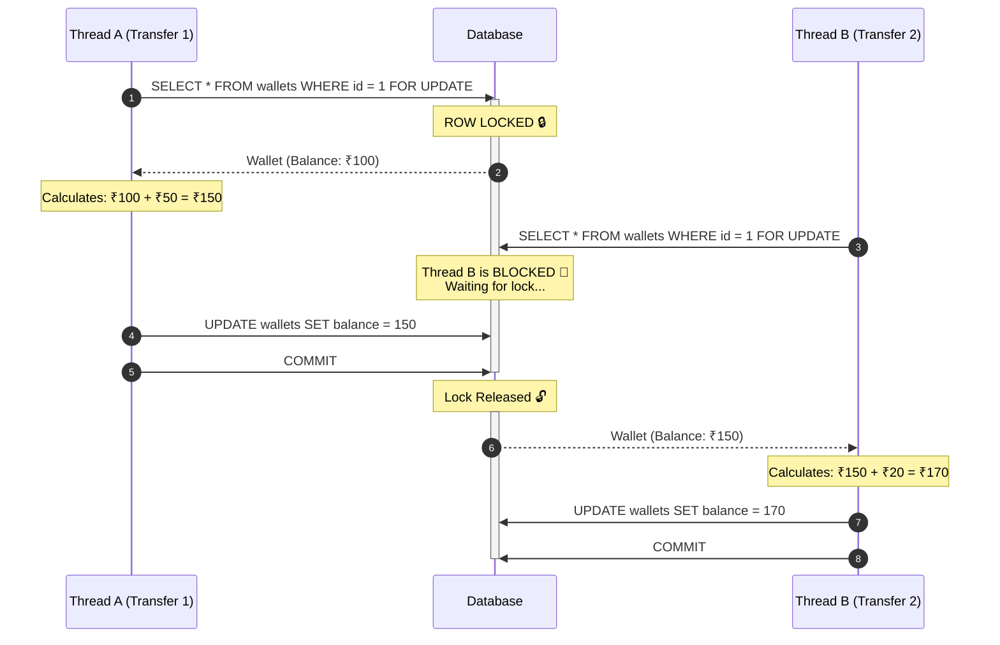
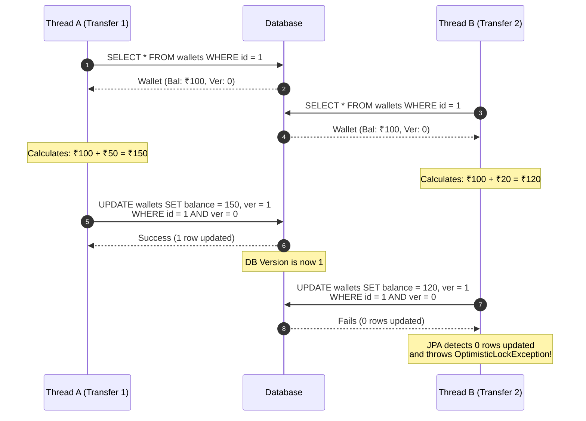

# The Developer's Guide to Database Locking Mechanisms

When building financial systems like a high-TPS wallet service, managing concurrent database transactions is one of the most critical challenges. If two users send money to the same wallet at the exact same millisecond, how do you prevent them from overwriting each other's updates?

This guide breaks down the two primary strategies to solve the "Lost Update" problem: **Pessimistic Locking** and **Optimistic Locking**.

---

## The "Lost Update" Problem

Without concurrency control, you run the risk of a lost update. Imagine a wallet has a balance of ₹100.
1. **Thread A** reads ₹100.
2. **Thread B** reads ₹100.
3. **Thread A** adds ₹50 and saves ₹150.
4. **Thread B** adds ₹20 to its read of ₹100, and saves ₹120.

Thread B just overwrote Thread A's transaction! The balance should be ₹170, but it is now ₹120. ₹50 has vanished.

---

## 1. Pessimistic Locking ("Assuming the Worst")

Pessimistic locking assumes that collisions are highly likely. To prevent them, it places a hard lock on the database row as soon as it reads it using queries like `SELECT ... FOR UPDATE`. No other transaction can read or write to that row until the lock is released.

### The Flow

> [!CAUTION]
> **Performance Impact**
> While Pessimistic Locking perfectly guarantees data integrity, it drastically reduces your system's throughput (TPS). If hundreds of transactions try to hit the same wallet simultaneously, threads pile up waiting for locks, potentially causing connection pool exhaustion and system timeouts.

---

## 2. Optimistic Locking ("Assuming the Best")

Optimistic locking assumes collisions are rare. It **does not lock** the database. Instead, it relies on a `version` number on the row. Every time the row is updated, the version increments. If a thread tries to update a row using an outdated version number, the database rejects the update.

In JPA, this is achieved simply by adding `@Version private Long version;` to your entity.

### The Flow

> [!TIP]
> **Handling the Exception**
> When Thread B receives the `OptimisticLockException`, the application simply catches the error, re-fetches the latest state from the database (which is now Balance = ₹150, Ver = 1), and attempts the transaction again. This is called a **Retry Mechanism**.

### Why Optimistic Locking Wins for High TPS
Because no locks are held during the database reads, millions of requests can flow through the system simultaneously without waiting on each other. You only pay a "penalty" (the retry) in the rare instance that two threads touch the exact same user's wallet at the exact same millisecond.
